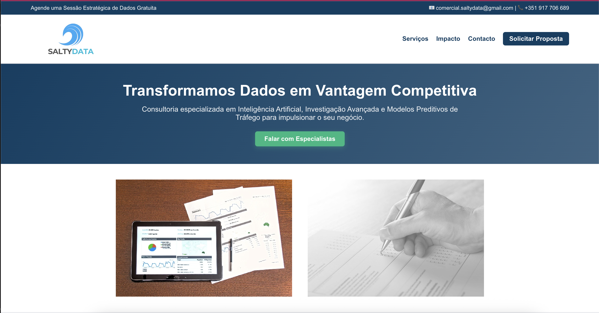
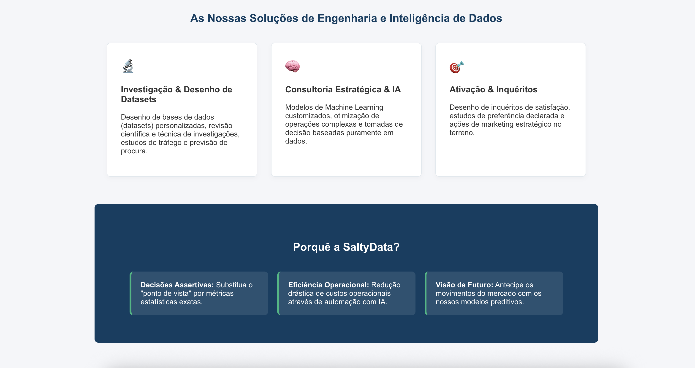
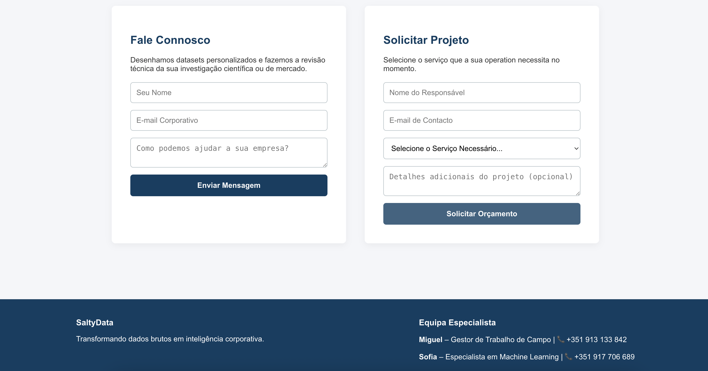

# SaltyData — Brand & Portfolio Website

> Website developed for **SaltyData**, a freelance initiative focused on connecting real-world data collection with analysis, modelling and AI.

---

## Overview

This repository contains the website I designed and developed for **SaltyData**, my own freelancing brand.

The project combines **brand design, frontend development and content structuring** into a single small web project.

### Landing page

### Services / positioning

### Call to action

## Brand

**SaltyData**

A freelance initiative focused on data collection, analysis and applied AI/ML, with an emphasis on understanding the problem and the data before choosing the technology.

The visual identity uses a **wave/ocean-inspired concept** to represent the movement from physical reality and field observations towards structured data and actionable information.

---

## Project status

**Active / evolving**

The website represents an early version of the SaltyData brand and may evolve alongside the business, including additional services, projects and case studies.

---

## Author

**Sofia Fernandes Condesso**

Data Scientist / ML Engineer

---

## License

The source code of this repository may be reused, modified and adapted for other projects.

However, **SaltyData is a registered trademark in Portugal**, and the SaltyData name, logo, visual identity, branding and associated original content are not included in this permission and may NOT be reused as part of another brand or project without authorization.

In detail:

* **Code:** reusable
* **SaltyData brand:** reserved
* **Logo and visual identity:** reserved
* **Original content and copy:** reserved

